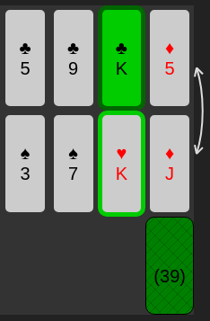
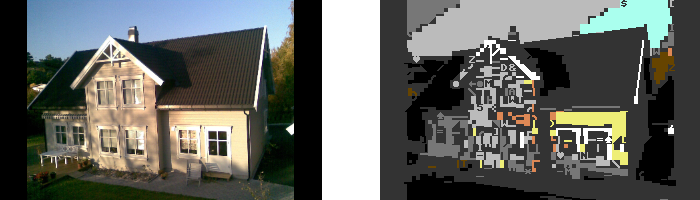

# Hello

My name is Simen Lysebo.

I work as a senior web developer at Schibsted Marketing Services in Oslo, Norway.

I have a strong fondness for JavaScript, HTML, SVG and CSS.
Below are some of my recent spare time projects,
because I can't get enough of them bits and bytes, ya know?

Regarding the photo: It's the nearest color in the Commodore 64 color palette. The dominant color is set as background, and for each 8x8 pixel chunk the nearest color is kept. If you must know.

Feel free to check out  
- [Games](#games)
    - [Knuts Kabal](#knuts-kabal-2021)
    - [Sliding Tile Puzzle](#sliding-tile-puzzle-2021)
    - [Loopz](#loopz-2021)
    - [Tetris](#tetris-2021)
- [Stuff](#stuff)
    - [Image to PETSCII Converter](#image-to-petscii-converter-2020)
    - [C64 BASIC Converter/Parser](#c64-basic-converterparser-2020)

I will add more later.

# Games

## Knuts Kabal (2021)

Try it: https://lysebo.xyz/games/kabal/  
Code/docs: https://github.com/mkeke/2021-knuts-kabal  

This is a solitaire card game, and also my first go at learning React.
I'm impressed by how changes in state variables automatically updates the affected DOM elements! Having written games in vanilla JS for some time - and won many battles with state/DOM changes - React feels a bit like cheating. Suddenly there are numerous issues I don't have to worry about anymore! I want to keep exploring React in upcoming games. Why didn't I find time to learn this many years ago?

## Sliding Tile Puzzle (2021)

Try it: https://lysebo.xyz/games/slidepuzzle/  
Code/docs: https://github.com/mkeke/2021-slide-puzzle  

As the title suggests, solve the puzzle by sliding the tiles into position
and revealing the image.
Select the desired tile grid and shuffle between some predefined images.
You can even add your own image by drag/drop, file upload or via your mobile camera.
This game was made during devtober 2021. This is the first time I've had such a tight deadline for spare-time projects. I realized that I prefer much more time, so that I can feast on perfecting the details more. But it turned out nice! I'm particularly satisfied with the custom image features, aswell as the settings panel with all the nice SVG icons.

Created with vanilla JS, profiting heavily from techniques and learnings from the first two games I made in 2021 (see below).

## Loopz (2021)

Try it: https://lysebo.xyz/games/loopz/  
Code/docs: https://github.com/mkeke/loopz  

A tribute remake of a game originally released on the Atari ST and Amiga 500 in 1990.
This was one of my favourite games growing up. I've spent a lot of time studying
the details of the game in order to recreate it as accurately as possible,
in terms of both graphics and gameplay. The graphics is 100% SVG/CSS.
I even reconstructed the charsets used in the original game, giving the new version
a slightly more updated look&feel.
Please read all about it! This was an enjoyable pasttime and I am really proud of the result. It has been on my bucket list for many years (I did actually create a version in Java in 2001)!

Just like Tetris, this was created with vanilla JS. No frameworks were used because I wanted to be exposed to (and learn from) all the aspects involved.

## Tetris (2021)

Try it: https://lysebo.xyz/games/tetris/  
Code/docs: https://github.com/mkeke/tetris  

Entering 2021 my ambition was to focus on approximately one medium/large spare
time project at a time and to get some progress done every week. I chose to
implement a Tetris clone, inspired by the two Tetris games I have played the
most growing up.

Developing the game was a giant learning experience. Algorithms, code structure,
responsive game development across different browsers and devices. Observing and
analyzing the original games, trying to recreate features as "truly" as possible.
Having a large project - and weathering the impossible/tricky/boring parts - is
immensely rewarding. I have known this since 1987, but needed to confirm it
properly: I love programming.
 
Created with vanilla JS. No frameworks were used because I wanted to be exposed to (and learn from) all the aspects involved.  

# Stuff

## Image to PETSCII Converter (2020)

Try it: https://lysebo.xyz/tools/image-to-petscii/  
Code/docs: https://github.com/mkeke/c64-image-to-petscii  

Have you ever wondered what an image would look like if it was converted to the Commodore 64 color palette, PETSCII character set and the 40x24 standard character text mode environment? This is your lucky day! Drag-drop an image onto the converter and watch the different conversion stages. Adjust brightness and saturation level to make the final image perfect. Download images from any stage, or even a fully functional C64 BASIC code that can be run in your emulator as proof!

The house still looks like a house, right? Atleast now that you know it's a house..

I wanted to make an online version of an old php converter script that I made many years ago. The code is quick and dirty, just for fun. And it works!

## C64 BASIC Converter/Parser (2020)

Code/docs: https://github.com/mkeke/c64-basic-converter  

A nodejs command line utility that converts "enhanced" C64 BASIC into C64 BASIC, and
further into a PRG file that can be launched automatically in VICE (the Versatile Commodore Emulator).

"Enhanced" C64 BASIC is a format I have created to be able to code C64 BASIC programs more easily, by using labels instead of line numbers, any-length variable names, constants, macros, code formatting, comments etc.

While I love the Commodore 64, it is not a pleasant coding environment. I prefer a text editor and to organize the code in multiple files. Whenever a file is saved, the converter is triggered and the emulator loads the program. The generated code is not at all optimized, but it makes it easy to try more complex things without getting lost in the GOSUB/RETURNs and two-character variable names.

Also, it was fun to make a parser-ish thing in nodejs.
